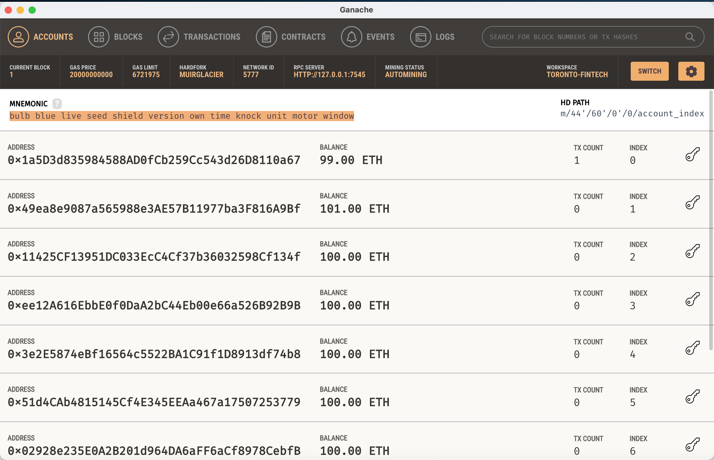
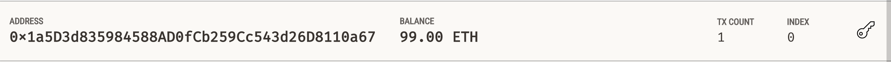
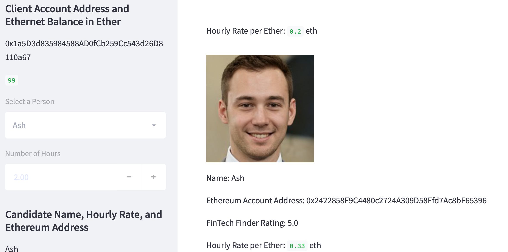
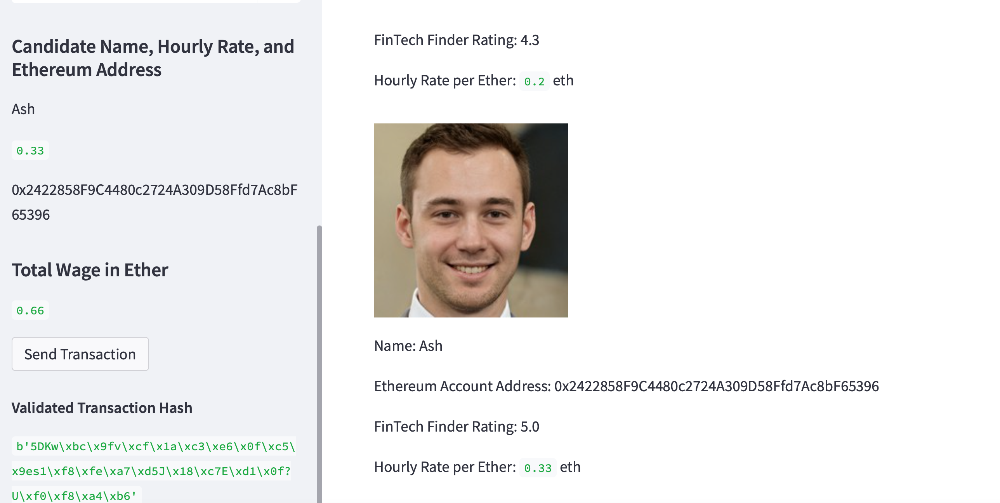
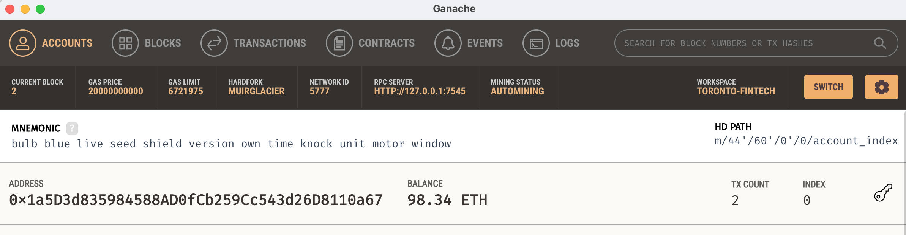
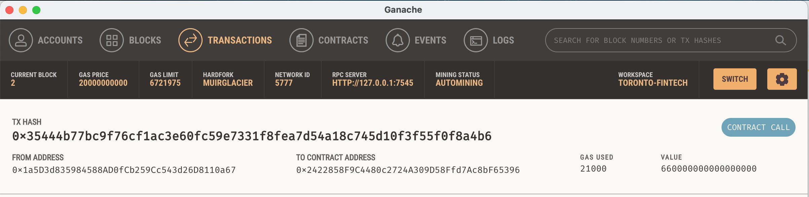
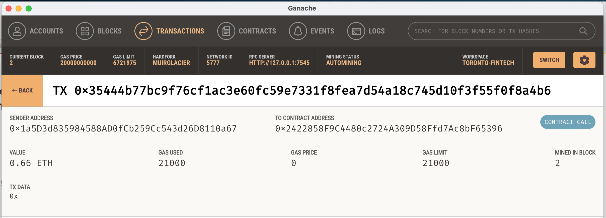

## Unit 19 Homework: Cryptocurrency Wallet
Integrate the Ethereum blockchain network into an application in order to enable  customers to instantly pay the fintech professionals whom they hire with cryptocurrency.   Automate the tasks associated with generating a digital wallet, accessing Ethereum account balances, and signing and sending transactions via a personal Ethereum blockchain called Ganache.

### Background

Fintech Finder is an application that its customers can use to find fintech professionals from among a list of candidates, hire them, and pay them. The task is to integrate the Ethereum blockchain network into the application in order to enable  customers to instantly pay the fintech professionals whom they hire with cryptocurrency.

### Contents

The first file is called `fintech_finder.py`. It contains the code associated with the web interface of the application. 

The second file is called `crypto_wallet.py`. This file contains the Ethereum transaction functions. It import statements,from  `crypto_wallet.py` Python script into the Fintech Finder interface program i.e in the `fintech_finder.py` file.

Integrating these two files allows to automate the tasks associated with generating a digital wallet, accessing Ethereum account balances, and signing and sending transactions via a personal Ethereum blockchain called Ganache.

### Steps taken

Specifically, following steps are taken -

* Generate a new Ethereum account instance by using the mnemonic seed phrase provided by Ganache.

* Fetch and display the account balance associated with your Ethereum account address.

* Calculate the total value of an Ethereum transaction, including the gas estimate, that pays a Fintech Finder candidate for their work.

* Digitally sign a transaction that pays a Fintech Finder candidate, and send this transaction to the Ganache blockchain.

* Review the transaction hash code associated with the validated blockchain transaction.

Transactions section of Ganache blockchain transaction details are shown below.

### Steps breakdown

The steps for this challenge are broken out into the following sections:

* Import Ethereum Transaction Functions into the Fintech Finder Application
* Sign and Execute a Payment Transaction
* Inspect the Transaction on Ganache

#### Step 1: Import Ethereum Transaction Functions into the Fintech Finder Application

Several functions from the `crypto_wallet.py` script into the file `fintech_finder.py`, which contains code for Fintech Finder’s customer interface, in order to add wallet operations to the application. (The Ethereum wallet and account information to the application are created).

#### Step 2: Sign and Execute a Payment Transaction

It will calculate a fintech professional’s wage, in ether, based on the worker’s hourly rate and the number of hours that they work for a customer. (The fintech professionals’ hourly rates are provided in the `candidate_database` that is found in `fintech_finder.py`.)

It then uses the calculated wage value to send a transaction that pays the worker. This code allows Fintech Finder customer to authorize the transaction with their digital signature. For the purpose of testing out this application, the Ethereum account information from local Ganche blockchain is used as the customer account information.

This is accomplished using  the following steps:

1. Fintech Finder customers will select a fintech professional from the application interface’s drop-down menu, and then input the amount of time for which they’ll hire the worker. The application will calculate the amount that the worker will be paid in ether.  This is done using the following steps:

    * The candidate’s wage is calculated by multiplying the hourly wage with the number of hours worked. 

2. Then allow a customer to send an Ethereum blockchain transaction that pays the hired candidate. To accomplish this, the `send_transaction` function (which is imported from the `crypto_wallet` script file) is used and required data like etherreum account information, candidate_address, wage is passed

#### Step 3: Inspect the Transaction

The application’s web interface can be used to test the transaction, and we can then look up the resulting transaction in Ganache. 

1. Select a candidate that was hired from the appropriate drop-down menu. Then, enter the number of hours that they worked. 

2. Click the Send Transaction button to sign and send the transaction

---

## Client accounts initial balance in Ganache local blockchain

---
## Balance in client account used to send ether
The Client's account address 0x1a5D3d835984588AD0fCb259Cc543d26D8110a67 is used to send the ether and initially it shows a balance of 99 ETH

---
## Selected candidate and amount of hours to be paid
The Client selected candidate Ash who worked for 2 hours , has an hourly rate of 0.33 ether and whose ethereum account address is  0x2422858F9C4480c2724A309D58Ffd7Ac8bF65396 

---
## Streamlit page after sending ether showing transaction hash
The total wage to be paid for 2 hours at hourly rate of 0.33 ETH comes to 0.66 ETH

---
## Remaining balance in client account after sending ether
The remaining balance will be Initial balance - ETH send + transaction fees (0 in this case as this is local proof of auhtority blockchain) which is 99 - 0.66 = 98.34

---
## Transaction details in Ganache local blockchain
The below screenshot shows the details of the transation from sender address (0x1a5D3d835984588AD0fCb259Cc543d26D8110a67) to recipient address (0x2422858F9C4480c2724A309D58Ffd7Ac8bF65396)

---
## Additional transaction details in Ganache local blockchain

---
